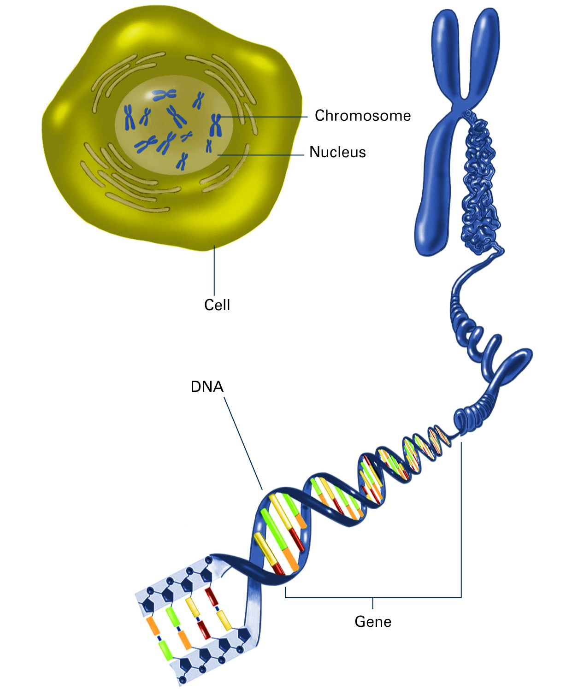
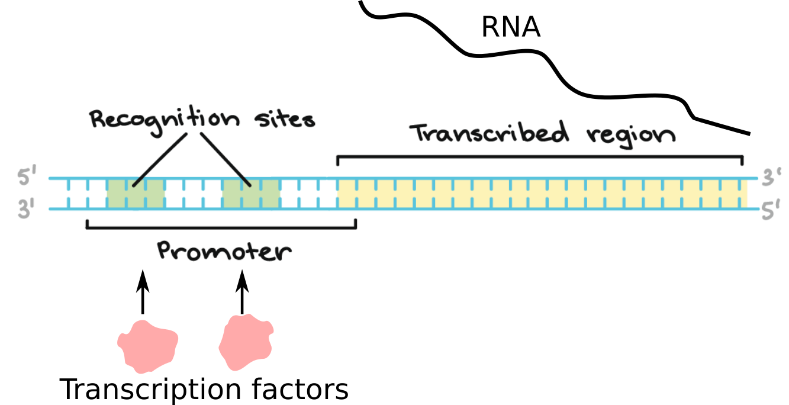

# Exercises background - DNA sequence analysis

In this week's exercises, we will analyze DNA sequences. Below is some background information which can be useful to better understand the context.

## The genome
* The genome encodes the blueprint of a living organism
* It is made up of long DNA polymer(s) called chromosomes
* 4 bases abbreviated A,C,G,T make up the code of DNA
* DNA is a double helix consisting of 2 antisense strands
* Complementary nucleotides from opposite strands pair together (A:T and C:G)

image: nigms.nih.gov

## Genes and promoters

* Functional units of the genome are called genes
* Active genes are "transcribed" into a RNA (used as template to make proteins)
* Promoter: Regulatory region before the gene transcription start site (TSS)
* Promoters contain sequence motifs which conditionally recruit other proteins (transcription factors) to regulate gene transcription

image modified from khanacademy.org
